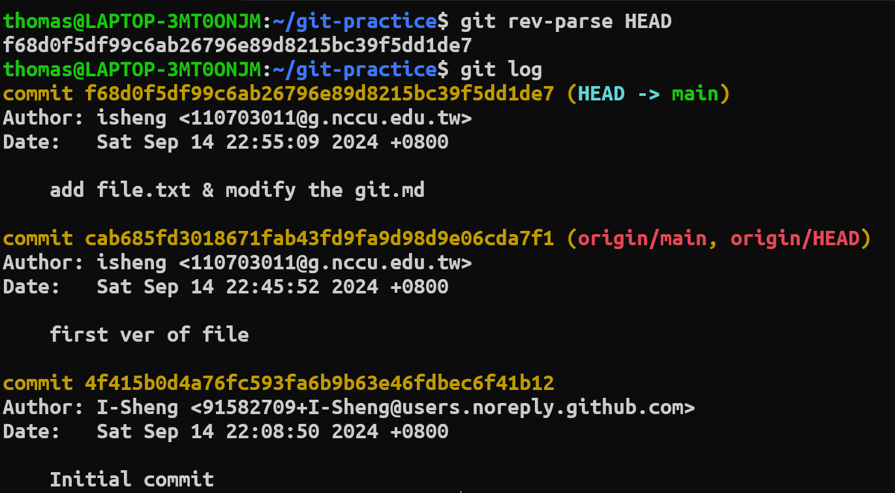
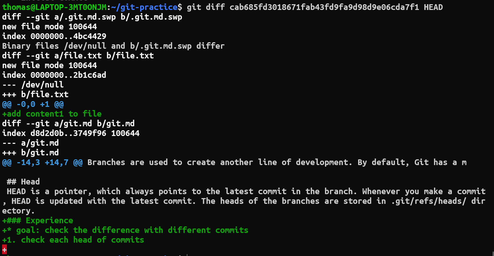
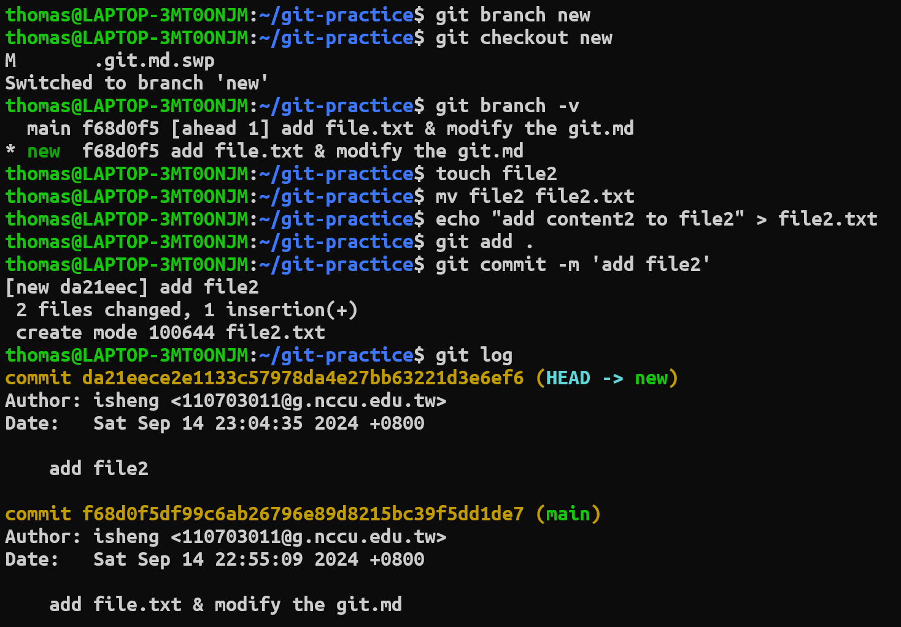
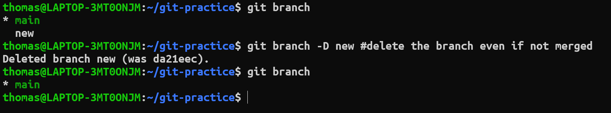
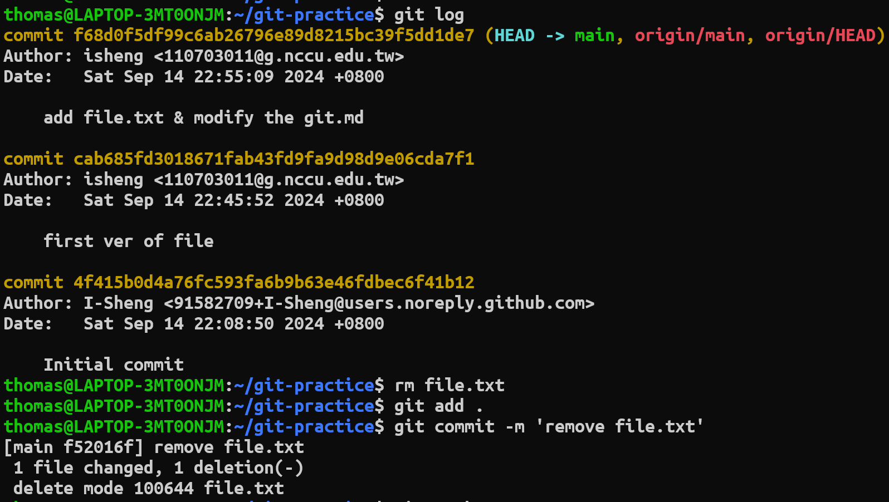
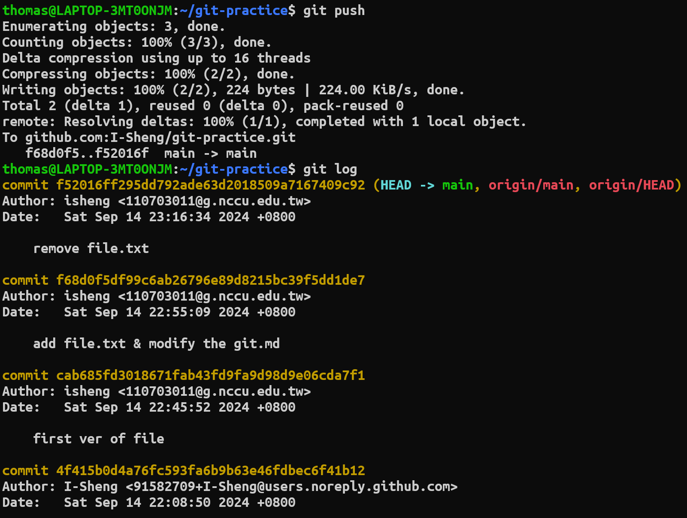
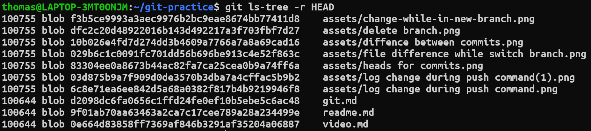

# Key concepts in git
* Git是一個按內容定位的檔案系統其中包含四種類型的物件(blob, tree, commit, tag)
## Blobs
Blob(Binary Large Object)是根據檔案(jpg, pdf, png...)，或是文件的內容(與檔名無關)所計算出來的SHA1 hash值，在git中做為物件存在，其在.git中位置為.git/objects。
```bash
# Can use git hash-object to find the SHA1 hash value, example as follows:
cat readme.md | git hash-object -w --stdin
```


## Trees
Tree是git中的一種物件，代表檔案的目錄。他的內容包含目錄底下的檔案模式(file mode)、檔案類別(type)，檔案SHA1 hash值、檔案名稱。
* tree內容範例如下:


## Commits
Commit holds the current state of the repository. A commit is also named by SHA1 hash. You can consider a commit object as a node of the linked list. Every commit object has a pointer to the parent commit object. From a given commit, you can traverse back by looking at the parent pointer to view the history of the commit. If a commit has multiple parent commits, then that particular commit has been created by merging two branches.

## Branches
Branches are used to create another line of development. By default, Git has a master branch, which is same as trunk in Subversion. Usually, a branch is created to work on a new feature. Once the feature is completed, it is merged back with the master branch and we delete the branch. Every branch is referenced by HEAD, which points to the latest commit in the branch. Whenever you make a commit, HEAD is updated with the latest commit.

## Head
HEAD is a pointer, which always points to the latest commit in the branch. Whenever you make a commit, HEAD is updated with the latest commit. The heads of the branches are stored in .git/refs/heads/ directory.
# Experience
* goal: check the difference with different commits
1. check each head of commits

2. difference between two git commits

3. Log change while commit in a new branch

4. File difference while switch bach to main branch

    * Learing: while switch to another branch the file committed in the origin branch will not appear if the new branch is not based on the origin branch.
5. Delete branch

    * Compare with git branch -d (Use "git branch -h" to get more info )
6. Log change during push command


    * The remote change after push command
7. Tree in git

    * The tree contains bolbs which is a content-addressed hash


## 參考資料
1. [Git basic concepts](https://www.tutorialspoint.com/git/git_basic_concepts.htm)
2. [深入 Git：Git 物件儲存 - blob 物件](https://titangene.github.io/article/git--blob-object.html)
