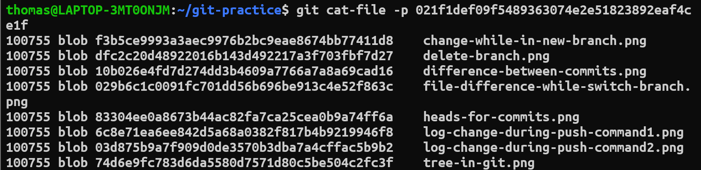
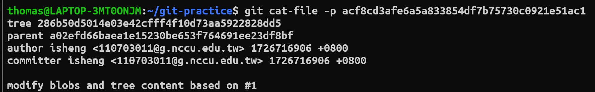
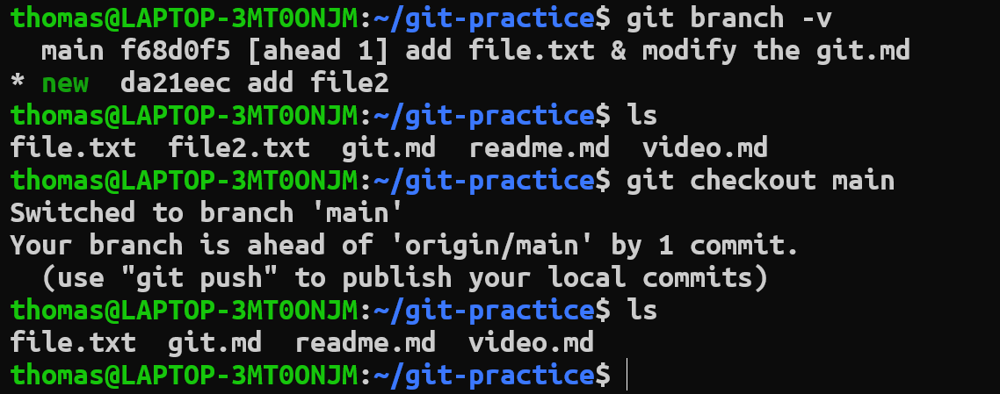

# Key concepts in git
* Git是一個按內容定位的檔案系統其中包含四種類型的物件(blob, tree, commit, tag)，並且這些物件是不可以被修改的。
## Blobs
Blob(Binary Large Object)是根據檔案(jpg, pdf, png...)，或是文件的內容(與檔名無關)所計算出來的SHA1 hash值，在git中做為物件存在，其在.git中位置為.git/objects。
```bash
# Can use git hash-object to find the SHA1 hash value, example as follows:
cat readme.md | git hash-object -w --stdin
```


## Trees
Tree是git中的一種物件，代表檔案的目錄。他的內容包含目錄底下的檔案模式(file mode)、檔案類型(type)，檔案SHA1 hash值、檔案名稱。
* tree內容範例如下:


## Commits
Commit是一個對整個專案當前狀態的描述。他是Git中的物件，在Git中，Commit類似資料結構中的Linked list，可以透過Commit回到過去的檔案狀態。但因為Commit是單向的，所以在個別branch中，回到過去後，就無法回到當前的未來狀態!
* Commit content:

* Git中物件之間的關係


## Branches
branch基本上是基於開發新的功能。原本只有一個main branch，使用這可以根據開發需求新增切換branch。每個branch都會有一個自己的HEAD指向branch當前最新的commit。當branch需要合併時，若有衝突(改到同個file)，需要進行git merge等指令修復。
* 在一個branch上進行修改，並不會影響到其他branch


## Head
HEAD是一個指標，指向當前branch最新的Commit，存在".git/refs/heads/"目錄中。

## .git change
* 當我們對git進行Commit時，git會對專案中修改的tree, blobs計算SHA1 hash，並把新的SHA1 hash前兩個字母當成目錄、剩下38個字母當成檔名存在".git/objects"目錄中。另外，Git也會將commit這個object以相同方式存在".git/objects"。最後會更新進行Commit的branch的HEAD並存在".git/refs/heads/"目錄中。

## Commit message
* 根據以下三項Commit訊息格式進行編寫:
1. <type>[optional scope]: <description>
    * 根據更改的類型(ex. feat, fix, test, build...)，後面可以增加":"使type更明顯
    * [optional scope]: Any additional information
    * <description>: 簡單介紹做了哪些更動
2. [optional body]
    * 介紹進行了哪些更動(看情況使用，若修改不大，可以寫在前面的description)
3. [optional footer(s)]: issue tracker(using issue id)
    * 如果有指向issue id或指向其他專案再使用

# 參考資料
1. [Git basic concepts](https://www.tutorialspoint.com/git/git_basic_concepts.htm)
2. [深入 Git：Git 物件儲存 - blob 物件](https://titangene.github.io/article/git--blob-object.html)
3. [第 06 天：解析 Git 資料結構 - 物件結構](https://github.com/doggy8088/Learn-Git-in-30-days/blob/master/zh-tw/06.md)
