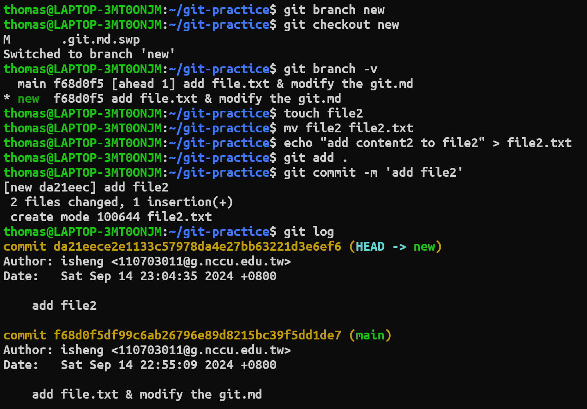

# Key concepts in git
* The description refers to [this site](https://www.tutorialspoint.com/git/git_basic_concepts.htm)
## Blobs
Blob stands for Binary Large Object. Each version of a file is represented by blob. A blob holds the file data but doesn’t contain any metadata about the file. It is a binary file, and in Git database, it is named as SHA1 hash of that file. In Git, files are not addressed by names. Everything is content-addressed.

## Trees
Tree is an object, which represents a directory. It holds blobs as well as other sub-directories. A tree is a binary file that stores references to blobs and trees which are also named as SHA1 hash of the tree object.

## Commits
Commit holds the current state of the repository. A commit is also named by SHA1 hash. You can consider a commit object as a node of the linked list. Every commit object has a pointer to the parent commit object. From a given commit, you can traverse back by looking at the parent pointer to view the history of the commit. If a commit has multiple parent commits, then that particular commit has been created by merging two branches.

## Branches
Branches are used to create another line of development. By default, Git has a master branch, which is same as trunk in Subversion. Usually, a branch is created to work on a new feature. Once the feature is completed, it is merged back with the master branch and we delete the branch. Every branch is referenced by HEAD, which points to the latest commit in the branch. Whenever you make a commit, HEAD is updated with the latest commit.

## Head
HEAD is a pointer, which always points to the latest commit in the branch. Whenever you make a commit, HEAD is updated with the latest commit. The heads of the branches are stored in .git/refs/heads/ directory.
### Experience
* goal: check the difference with different commits
1. check each head of commits

