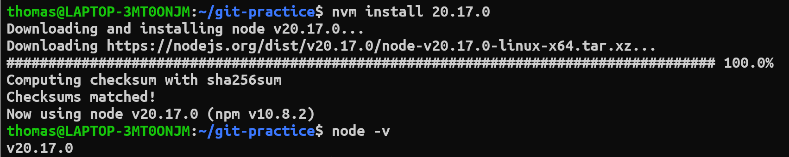

1. 安裝的 nodejs 版本: v20.17.0
2. 選擇原因: 我們小組的人都使用過node.js因此決定使用它，另外v20.17.0是我們成員中node.js比較新的版本，因此選擇這個版本。
3. nvm 與 npm 分別是什麼
    * npm(Node Package Manager)是Node.js預設的套件管理工具。幫助使用者解決套件相依性的問題。
    * nvm(Node Version Manager)是Node.js的版本管理工具。可以幫助Node.js在不同版本之間切換，幫助使用者在不同專案之間協作(使用不同的Node.js)版本。
#### nvm使用方式
```bash
$ nvm use 16
Now using node v16.9.1 (npm v7.21.1)
$ node -v
v16.9.1
$ nvm use 14
Now using node v14.18.0 (npm v6.14.15)
$ node -v
v14.18.0
$ nvm install 12
Now using node v12.22.6 (npm v6.14.5)
$ node -v
v12.22.6
```

